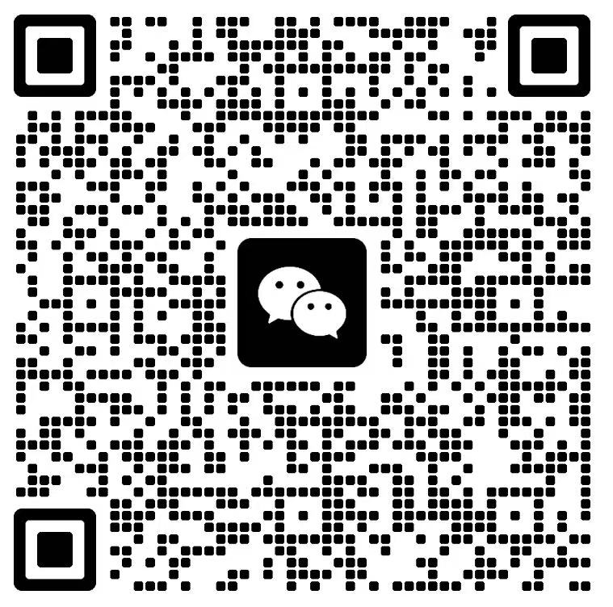

# Hi there, I'm Xu Zheng (许政) 👋

**Data Science & Big Data Technology** @ University of Jinan (undergraduate，2024–2028)
**数据科学与大数据技术** · 济南大学 (本科，2024–2028)

I build things at the intersection of **recommendation systems**, **user growth**, and **AI agents**. My work spans from research to production — training LLM-based recommenders, shipping open-source PRs to projects with 190K+ stars positively.
我的兴趣方向是**推荐系统**、**用户增长**与 **AI Agent**，工作覆盖从科研到工程——训练 LLM 推荐模型、并积极向 19 万 Star 级项目提交 PR。

## 🛠 Tech Stack / 技术栈

`Python` `C/C++` `TypeScript` `PyTorch` `Transformers` `Scikit-learn` `XGBoost` `LangChain` `FAISS` `FastAPI`

## 🔬 Research / 科研经历

**LLM-Enhanced Recommendation with P5 + Reinforcement Learning + Memory** LLM 增强推荐系统研究（P5 + 强化学习 + 记忆架构）

Reproduced P5 on T5 backbone for sequential recommendation, designed a POMDP-based RL policy network with FAISS long/short-term memory to replace Beam Search, and proposed a lightweight co-occurrence matrix embedding method.
基于 T5 复现 P5 推荐框架，设计 POMDP 强化学习策略网络结合 FAISS 长短期记忆系统，提出轻量级共现矩阵 Embedding 方案。

- [Repo / 仓库](https://github.com/returnSGD/LLMRec_recommendation)

## 🧩 Selected Projects / 项目经历

| Project / 项目 | Introduction / 简介 |  | link / 链接 |
|---------|------|----------|------|
| OneTrans & MixFormer: Unified Recommendation via Transformer 针对大规模数据推荐的序列建模与特征交互统一化推荐系统 | *Tencent Advertising Algorithm Competition × KDD Cup* — End-to-end single-stage recommendation unifying sequence modeling & feature interaction with Transformer, validated on million-scale interaction data. *腾讯广告算法大赛 × KDD Cup* — 统一 Transformer 架构将序列建模与特征交互整合为端到端单阶段处理，在百万级交互数据上验证。 | Transformer | — |
| Game Player Churn Prediction & Persona Platform `2025.3–4`游戏玩家流失预测与用户画像分析平台 | *National E-commerce "Three-Creation" Competition* — XGBoost churn prediction + KMeans persona clustering + BERT sentiment analysis on 46K reviews. *第十六届全国大学生电子商务"三创赛"* — XGBoost 流失预测 + KMeans 用户画像 + BERT 情感分析。 | XGBoost, KMeans, BERT | [Repo / 仓库](https://github.com/returnSGD/User_growth_monitoring) |
| Claude MD Editor — AI-Powered Desktop Markdown Editor Claude MD Editor：AI 驱动的桌面 Markdown 编辑器 | Electron + React + TypeScript desktop app with CodeMirror 6, KaTeX, Mermaid, and embedded Claude Code AI terminal. One-click export to HTML/PDF/DOCX/image. Electron + React + TypeScript 桌面应用，集成 CodeMirror 6、KaTeX、Mermaid，内嵌 Claude Code AI 终端，一键导出。 | Electron, React, TypeScript, CodeMirror 6, KaTeX, Mermaid | [Repo / 仓库](https://github.com/returnSGD/claude-md) |
| arXiv MCP Server with DeepSeek Translation 接入 DeepSeek 的 arXiv 个性化检索 MCP 服务 | MCP-protocol academic search with Chinese→English translation, arXiv retrieval, and semantic re-ranking. FastAPI + fastapi-mcp SSE endpoint. 基于 MCP 协议的学术检索服务，中文翻译→arXiv 检索→语义重排序，FastAPI + fastapi-mcp SSE 端点。 | FastAPI, fastapi-mcp SSE | [Repo / 仓库](https://github.com/returnSGD/arxiv_MCP) |
| AI Customer Service with LoRA + RAG + LLM 集成 LoRA 微调、RAG 检索与大模型的智能对话 AI 客服系统 | Three-layer architecture: RAG (Sentence-Transformers + FAISS) → DeepSeek candidate generation → LoRA-tuned MacBERT for reply ranking. "RAG 知识检索 → DeepSeek 候选回复 → LoRA 排序"三层智能客服架构。 | RAG (Sentence-Transformers, FAISS), DeepSeek, LoRA, MacBERT | [Repo / 仓库](https://github.com/returnSGD/AI_customer_service) |
| Cat Language System for "Whispers of the Heart" 腾讯游戏创作大赛作品《猫语心声》猫咪 AI 决策控制与语言系统 | *Tencent Game Creation Competition* — Three-tier cat AI: RL strategy layer + custom behavior tree engine + local DeepSeek-R1-Distill-Qwen-1.5B for emotional monologues. *腾讯游戏创作大赛* — 猫咪 RL 策略层 + 自研行为树引擎 + 本地 DeepSeek 1.5B 语言模型三层架构。 | RL, behavior tree, DeepSeek-R1-Distill-Qwen-1.5B | [Repo / 仓库](https://github.com/returnSGD/TGA2026/tree/main/cat_control) |

## 🤝 Open Source Contributions / 社区贡献

| Project / 项目 | ✨ / Stars | Contribution / 贡献 |
|---|---|---|
| [n8n](https://github.com/n8n-io/n8n/pull/32629) | 193K | Fixed v2.24.0 regression crash in Form Trigger node. **Merged.** / 修复 Form Trigger 节点回归崩溃 Bug。**已合并。** |
| [LightRAG](https://github.com/HKUDS/LightRAG/pull/3269) | 36.6K | Refactored NDJSON streaming parser, fixed stream error bug. **Merged.** / 重构 NDJSON 流式解析模块，修复流错误分类 Bug。**已合并。** |
| [TensorTrade](https://github.com/tensortrade-org/tensortrade/pull/499) | 6.3K | Added short-selling support to OMS & Action Schemes. **Submitted.** / 为 OMS 和 Action Schemes 添加做空支持。**已提交。** |
| [AI_HR_Project](https://github.com/Begapunk/AI_HR_project/pull/3) | — | Batch resume screening pipeline with LLM scoring. **Merged.** / 批量简历筛选模块，LLM 多维评分排序。**已合并。** |
| [WeMD](https://github.com/tenngoxars/WeMD/pull/82) | — | Removed hardcoded font-size in table renderer. **Merged.** / 移除表格渲染器硬编码字体大小。**已合并。** |

## 💬 技术交流 / 闲聊群

技术交流/闲聊群如下（2026.7.5失效）：

最后说一句，安魂曲可爱捏🍅🍅🍅
